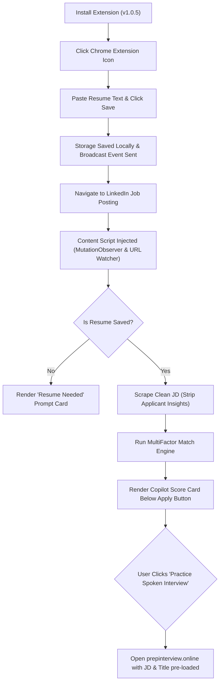

# Product Requirements Document (PRD)
## PrepInterview Copilot — LinkedIn Job Match & AI Mock Prep (v1.0.5)

---

## 1. Executive Summary & Product Vision

**PrepInterview Copilot** is a privacy-first, client-side Chrome Extension that anchors directly into the LinkedIn Jobs interface. It evaluates job applications using a multi-factor matching engine (Skills, Experience, Location, and Education Tier) and provides a 1-click bridge into realistic spoken AI mock interview practice.

### The Problem
1. **Keyword Illusion:** Existing job tools only count basic resume keyword density. Candidates with a "95% keyword match" often get disqualified instantly due to hard qualification mismatches:
   - Experience gaps (e.g. 1.3 years vs. 3–5 years required).
   - Degree requirements (e.g. strict mandatory MBA vs. B.Tech).
   - Institutional pedigree filters (e.g. Tier-1 IIT/NIT mandates).
   - Work mode / Location constraints (e.g. mandatory On-site in Bengaluru while candidate lives in Delhi).
2. **Generic Interview Practice:** Candidates prepare with generic questions ("Tell me about yourself") rather than defending their exact resume bullet points against the specific job description they are applying to.
3. **Privacy Concerns:** Job seekers are hesitant to upload their resumes to third-party databases or cloud resume parsers.

### The Solution
A zero-cloud, 100% local in-browser extension that:
- Reads the candidate's master resume saved in Chrome local storage.
- Automatically scrapes the active job details pane on LinkedIn.
- Computes an honest recruiting fit score (0–100%) and categorizes the application tier.
- Highlights matched skills, missing skills, and generic requirement gaps (`College not matching`, `Work experience not matching`, `Degree not matching`, `Location not matching`).
- Offers a 1-click CTA to practice a real-time, spoken AI mock interview specifically customized to that job description and candidate profile on `prepinterview.online`.

---

## 2. Target Audience & Personas

| Persona | Description | Key Pain Point | Copilot Value Proposition |
| :--- | :--- | :--- | :--- |
| **Product & BizOps Professionals** | Growth PMs, APMs, Founder's Office Associates, Strategy Analysts | High competition; roles frequently mandate pedigree (Tier-1) or specific tool stacks (SQL, Python, Growth). | Instantly flags whether a role is a reachable stretch or has hard pedigree/experience knockouts. |
| **Tech & Engineering Freshers / Early Career (0–3 yrs)** | Software Engineers, Data Analysts, QA/DevOps | Misled by "Entry Level" LinkedIn tags that actually require 3+ years in the JD body. | Extracts true minimum experience from the JD body and flags experience gaps before applying. |
| **Active Job Hunters (High Volume)** | Applying to 10–25 jobs daily on LinkedIn | Spending hours reading long JD text only to discover disqualifiers in the bottom paragraph. | Ambient intelligence: Card renders inside the job pane in under 300ms. |

---

## 3. Core Features & Functional Requirements

### 3.1 Local Resume Management (Popup UI)
- **FR-1.1 Plain-Text Storage:** User pastes their plain-text resume into a clean textarea.
- **FR-1.2 Privacy & Storage:** Data is persisted solely in `chrome.storage.local` under the key `resumeText`. No external server calls, analytics tracking, or telemetry.
- **FR-1.3 Live Word Counter:** Live counter displays word count (`X words`).
- **FR-1.4 Instant Broadcast:** Saving or clearing the resume broadcasts a `RESUME_UPDATED` runtime message and triggers `chrome.storage.onChanged` to refresh all open LinkedIn tabs within milliseconds without a page reload.

### 3.2 Automated In-Page Job Evaluation (Content Script)
- **FR-2.1 Non-Intrusive DOM Injection:** Automatically identifies the LinkedIn Job Pane and injects the Copilot Card directly below the primary CTA bar (`Apply` / `Save` buttons).
- **FR-2.2 SPA & Dynamic Navigation Handling:** Works across LinkedIn's single-page architecture (`/jobs/view/`, `/jobs/collections/`, search lists, two-pane view) using a debounced `MutationObserver` and `popstate` listener.
- **FR-2.3 Applicant Insights Sanitization:** Automatically strips out LinkedIn's auxiliary DOM elements (e.g. `.jobs-premium-applicant-insights`, hiring team widgets, company info boxes) to prevent candidate demographic statistics from polluting JD requirement extraction.
- **FR-2.4 Resume Fingerprinting:** Computes a lightweight fingerprint of the active resume. Only re-evaluates when navigating to a new Job ID or when the resume text changes.

### 3.3 Multi-Factor Recruiting Engine (`matcher.js`)
- **FR-3.1 Core Skill Taxonomy:** 100+ industry keywords across Tech, Product, Growth, Strategy, Marketing, Sales, Operations, and Analytics.
- **FR-3.2 Fallback Token Matching:** If a job uses non-standard taxonomy terms, the engine performs frequency-weighted token overlap after stripping standard English stop words.
- **FR-3.3 Work Experience Analysis:**
  - Extracts work experience ranges from candidate resume (including date-math like `Jul 2023 - Present` $\rightarrow$ 1.3 years).
  - Extracts stated experience requirements from JD (e.g. `2-4 years`, `3+ yrs`).
  - Penalizes step-wise: $<1$ yr gap: $-12$ pts; $1–2$ yr gap: $-22$ pts; $\ge 2$ yr gap: $-35$ pts.
- **FR-3.4 Comprehensive Indian College Tier Classification:**
  - **Tier 1:** All 23 IITs, BITS Pilani (all campuses), Top NITs (Trichy, Surathkal, Warangal, etc.), Top IIITs (Hyderabad, Bangalore, Delhi, Allahabad), DTU, NSUT, Jadavpur, Top IIMs (BLACKI), XLRI, FMS, SPJIMR, ISB, Global Elite (Stanford, MIT, Harvard, etc.).
  - **Tier 2:** Mid/Newer NITs, Mid IIITs, Leading Tech Universities (Thapar, VIT, Manipal, BIT Mesra, RVCE, BMSCE, PES, SRM, KIIT, etc.), Respected B-Schools (Baby IIMs, IMT, XIMB, TAPMI, etc.).
  - **Tier 3:** Regional, state-affiliated, and private universities (Galgotias, Amity, LPU, Chandigarh University, Sharda, etc.).
- **FR-3.5 Preferred vs. Mandatory College Logic:**
  - *Preferred (`IIT/NIT strongly preferred`, `Tier-1 preferred`):* Tier 1 gets $+6$ bonus; Tier 2 gets $+2$ bonus; Tier 3 gets a modest $-8$ pt adjustment. **Zero disqualifiers.**
  - *Mandatory (`Only from Tier-1`, `Strictly IIT/NIT only`):* Tier 1 gets $+6$ bonus; Tier 2 and Tier 3 receive `College not matching` disqualifier.
  - *Unspecified:* Zero penalties, zero disqualifiers.
- **FR-3.6 Degree Alternatives & Preferences:**
  - Understands slash/or alternatives (e.g. `B.Tech/MBA`, `B.Tech or MBA`). Candidates with B.Tech are fully qualified.
  - Understands non-mandatory preferences (`MBA preferred`, `MBA desirable`). No penalties or disqualifiers if missing.
  - Only applies `Degree not matching` if explicitly mandatory (`Must have an MBA`, `Mandatory: PhD`).
- **FR-3.7 Work Mode & Location:**
  - Compares candidate location against job location for mandatory On-site roles across major metropolitan hubs (Bengaluru, Delhi NCR, Mumbai, Pune, Hyderabad, Chennai, Kolkata).

### 3.4 Card UI & Visual States
- **FR-4.1 Topline Score Pill & Tier:**
  - `🟢 80–98%: Strong Match`
  - `🟢 72–79%: Good Match`
  - `🟡 45–71%: Moderate Match (Gaps to Defend)`
  - `🔴 20–44%: Reach Role (Critical Gaps)`
- **FR-4.2 Clean Generic Requirement Gaps:**
  Displays clear, non-robotic pills under `⚠️ Requirement Gaps`:
  - `Work experience not matching`
  - `College not matching`
  - `Degree not matching`
  - `Location not matching`
  - `Role profile not matching`
- **FR-4.3 Skills Breakdown:** Collapsible view showing `✓ Matched Skills` (green pills) and `⚠️ Missing Skills / Focus Areas` (red/orange pills).
- **FR-4.4 Ambient Sticky Pill:** Bottom-right floating pill (`🎯 PrepInterview: 75%`) allowing candidates to jump directly to the evaluation card when scrolling long descriptions.

### 3.5 Spoken AI Mock Interview Bridge
- **FR-5.1 1-Click Launch:** Primary action button: `🎙️ Practice Spoken Interview for this Job (1-Click) ↗`.
- **FR-5.2 Deep-Link Context Pass-Through:** Encodes full sanitized JD, job title, and company name into the URL query parameters (`https://prepinterview.online/?jd=...&title=...&company=...&utm_source=linkedin_copilot`).

---

## 4. User Flows

---

## 5. Non-Functional Requirements

| Category | Requirement | Verification Standard |
| :--- | :--- | :--- |
| **Performance** | In-page parsing & card rendering must execute in under 300ms. | Evaluated via `performance.now()`. Content script uses sub-millisecond regex checks. |
| **Privacy & Security** | Zero external network calls from the extension. No credentials, cookies, or personal identities transmitted. | Manifest V3 permissions restricted solely to `storage` and host permission `*://*.linkedin.com/*`. |
| **Memory / CPU Overhead** | Debounced `MutationObserver` to prevent thread locking on LinkedIn's infinite scroll. | Filter out internal card mutations to avoid infinite DOM injection loops. |
| **Cross-Platform Compatibility** | Windows, macOS, Linux on Chrome, Brave, Edge, Arc (Chromium 100+). | Manifest V3 standard compliance. |
