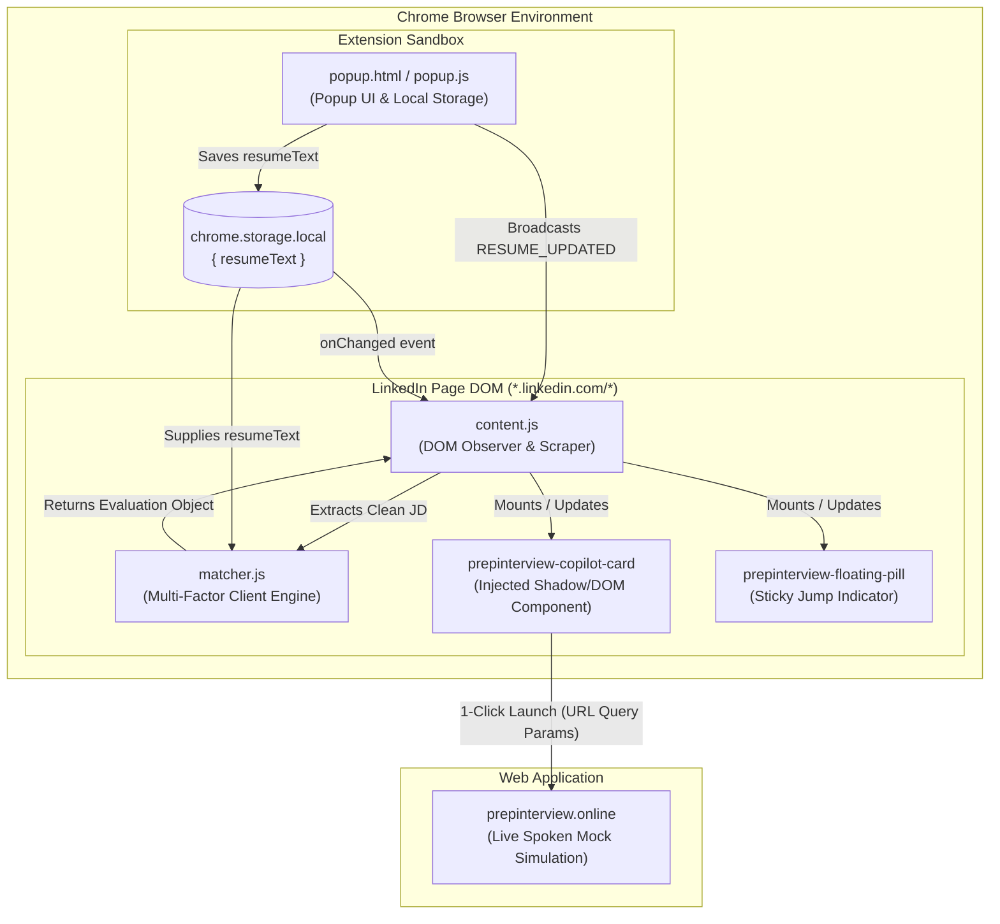
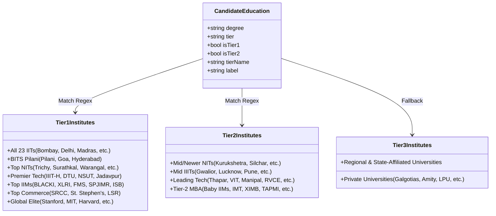
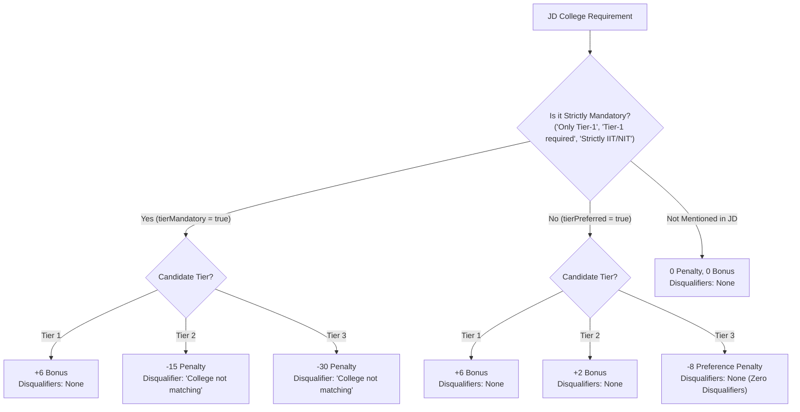

# Technical Architecture & Engineering Specification
## PrepInterview Copilot — Chrome Extension (v1.0.5)

---

## 1. Architecture Overview

PrepInterview Copilot is built on **Manifest V3** as an offline-first, client-side application. It operates without a backend database or intermediate cloud server. All parsing, evaluation, scoring, and UI rendering happen locally in the browser sandbox.



---

## 2. Directory & Component Structure

```
extension/
├── manifest.json            # Manifest V3 configuration, permissions, content script registration
├── popup/
│   ├── popup.html           # Master resume editor & info interface
│   ├── popup.css            # Dark-theme styles for popup modal
│   └── popup.js             # Storage management & tab broadcast controller
├── scripts/
│   ├── matcher.js           # Multi-Factor Match Engine & Indian College Tier Database
│   └── content.js           # LinkedIn DOM scraper, mutation observer, card renderer
├── styles/
│   └── widget.css           # Injected styles for embedded card, pills, and animations
└── icons/                   # Extension icons (16, 48, 128px)
```

---

## 3. Manifest V3 Configuration (`manifest.json`)

```json
{
  "manifest_version": 3,
  "name": "PrepInterview Copilot - LinkedIn Job Match & AI Mock Prep",
  "version": "1.0.5",
  "description": "See your real-time Resume Skill Match, Experience, Location & Education fit on LinkedIn Jobs and launch instant AI mock interview practice in 1 click.",
  "permissions": [
    "storage"
  ],
  "host_permissions": [
    "*://*.linkedin.com/*"
  ],
  "action": {
    "default_popup": "popup/popup.html",
    "default_title": "PrepInterview Copilot",
    "default_icon": { ... }
  },
  "content_scripts": [
    {
      "matches": ["*://*.linkedin.com/*"],
      "js": ["scripts/matcher.js", "scripts/content.js"],
      "css": ["styles/widget.css"],
      "run_at": "document_idle"
    }
  ]
}
```

### Security & Privacy Guarantees
- **Minimal Permissions:** Only `storage` is declared. No `webRequest`, `cookies`, `scripting`, or `identity` permissions.
- **Zero Network Egress:** The extension executes 0 outbound network requests. All dependencies are bundled locally.
- **Content Security Policy (CSP):** Standard Manifest V3 CSP prevents remote script execution.

---

## 4. Ingestion & DOM Sanitization Pipeline (`content.js`)

LinkedIn is a single-page application (SPA) where DOM elements mutate continuously as users navigate job lists, apply filters, and open panes.

### 4.1 MutationObserver & Debounce Engine
```javascript
let debounceTimer = null;
const observer = new MutationObserver((mutations) => {
  const isOurMutation = mutations.every(m => {
    const target = m.target;
    return target && target.closest && 
      (target.closest('#prepinterview-copilot-card') || target.closest('#prepinterview-floating-pill'));
  });
  if (isOurMutation) return; // Prevent infinite mutation feedback loops

  clearTimeout(debounceTimer);
  debounceTimer = setTimeout(runInjection, 300); // 300ms debounce
});

observer.observe(document.body, { childList: true, subtree: true });
```

### 4.2 DOM Sanitization (Anti-Pollution Layer)
LinkedIn injects candidate insights, premium features, and recruiter profiles into the job pane. If not removed, texts like *"Top universities of applicants: Indian Institute of Technology"* mislead regex parsers into believing the JD mandates an IIT degree.

```javascript
const junkSelectors = [
  '#prepinterview-copilot-card',
  '.jobs-premium-applicant-insights',
  '[data-view-name*="applicant-insights"]',
  '.jobs-unified-top-card__applicant-count',
  '.jobs-premium-insights',
  '.hiring-team',
  '.jobs-poster-profile',
  '.jobs-company__box',
  '.artdeco-card',
  'button',
  'svg',
  '[role="button"]'
].join(',');

// Clean clone extraction
const clone = el.cloneNode(true);
clone.querySelectorAll(junkSelectors).forEach(n => n.remove());
text = clone.innerText.trim();
```

### 4.3 Resume Fingerprinting & Re-Render Control
To prevent layout thrashing while still maintaining instantaneous reactivity, `content.js` computes a fingerprint of the active resume text:
```javascript
const resumeFingerprint = resumeText 
  ? (resumeText.length + '_' + resumeText.slice(0, 40).replace(/\s+/g, '')) 
  : 'none';

if (existing && existing.dataset.jobId === jobId && existing.dataset.resumeFingerprint === resumeFingerprint) {
  return; // Job and resume are identical, skip re-eval
}
```

### 4.4 Real-Time Cross-Component Synchronization
When a user updates their resume in the extension popup:
1. `popup.js` writes to `chrome.storage.local`.
2. `popup.js` broadcasts `{ action: 'RESUME_UPDATED' }` to all open `linkedin.com` tabs.
3. `content.js` listens to both `chrome.storage.onChanged` and `chrome.runtime.onMessage`:
```javascript
chrome.storage.onChanged.addListener((changes, areaName) => {
  if (areaName === 'local' && changes.resumeText) {
    const existing = document.getElementById('prepinterview-copilot-card');
    if (existing) existing.remove();
    runInjection();
  }
});
```

---

## 5. Multi-Factor Evaluation Engine (`matcher.js`)

The match engine implements a recruitment-grade heuristic scoring formula:

$$\text{Final Score} = \operatorname{clamp}\big(\text{SkillScore} - \text{Penalties} + \text{Bonuses},\ 20,\ 98\big)$$

### 5.1 Skill Match Computation
1. **Taxonomy Matching:**
   A curated set of 100+ keywords spanning Software Engineering, Product Management, Growth, Analytics, Strategy, and Operations.
   $$\text{SkillScore}_{\text{base}} = \operatorname{round}\left( \frac{|\text{MatchedSkills}|}{|\text{JdSkills}|} \times 100 \right)$$
2. **Fallback Token Overlap:**
   If a JD does not match taxonomy skills (e.g. niche or non-standard title), tokens longer than 4 characters are filtered against an English stop-word set (`years`, `experience`, `looking`, `skills`, `working`, etc.), calculating Jaccard-like overlap bounded between 35% and 88%.

---

### 5.2 Work Experience Extractor & Penalty Matrix
- **Candidate Experience:**
  - Extracts explicit year tags (e.g. `1.3 years`, `3+ yrs`).
  - Evaluates chronological date blocks: parses `Month YYYY - Present` or `Month YYYY - Month YYYY` and computes total duration using dynamic calendar calculation relative to the current year.
- **JD Requirement Extraction:**
  - Matches phrases: `X+ years`, `minimum X years`, `X to Y yrs of experience`.
- **Scoring Adjustment:**
  | Experience Gap | Penalty | UI Disqualifier |
  | :--- | :--- | :--- |
  | Meets or exceeds JD min experience | $+4$ Bonus | *None* |
  | Gap $< 1$ year (e.g. 1.3 yrs vs 2 yrs) | $-12$ pts | `Work experience not matching` |
  | Gap $1 \le \text{gap} < 2$ years | $-22$ pts | `Work experience not matching` |
  | Gap $\ge 2$ years (e.g. 1.3 yrs vs 4 yrs) | $-35$ pts | `Work experience not matching` |

---

### 5.3 Indian College Tier Classification Model



#### Tier 1 Regex Architecture:
- Handles abbreviations, hyphens, and punctuation variations:
  - `/\b(iit\b|iits\b|iitd\b|iitb\b|iitk\b|iitkgp\b|iitm\b|iitr\b|iith\b|iitg\b|iiti\b|iitgn\b|iitrpr\b|iitp\b|iitbbs\b|iitmandi\b|iitj\b|iittp\b|iitpkd\b|iitdhd\b|iitbhi\b|iitjm\b|iitbhu\b|iitism\b|indian\s+institute\s+of\s+technology)\b/i`
  - Strips periods (`i.i.t.` $\rightarrow$ `iit`).
  - Matches campus combinations (`IIT-Bombay`, `IIT Delhi`, `IIT (BHU)`).

---

### 5.4 Preferred vs. Mandatory College Logic



---

### 5.5 Degree Parser (Alternatives & Preferences)
- **Slash / OR Alternatives:** Recognizes `B.Tech/MBA`, `B.Tech or MBA`, `Bachelors / MBA`. If candidate holds a Bachelor's, MBA requirement is satisfied with 0 penalty.
- **Preference Indicators:** Recognizes `MBA preferred`, `MBA desirable`, `MBA is an advantage`. If missing, penalty is 0, disqualifiers = 0.
- **Strict Mandates:** Only applies `Degree not matching` if explicitly phrased as mandatory (`Must have an MBA`, `Mandatory: PhD`).

---

### 5.6 Rating Tier & Badge Assignment

```javascript
if (disqualifiers.length >= 2 || finalScore < 45) {
  tier = 'Reach Role (Critical Gaps)';
  badge = '🔴';
  color = '#f85149';
} else if (disqualifiers.length === 1 || (finalScore >= 45 && finalScore < 72)) {
  tier = 'Moderate Match (Gaps to Defend)';
  badge = '🟡';
  color = '#d29922';
} else if (finalScore >= 80) {
  tier = 'Strong Match';
  badge = '🟢';
  color = '#3fb950';
} else {
  tier = 'Good Match';
  badge = '🟢';
  color = '#2ea043';
}
```

---

## 6. Deep-Link Context Bridge (`prepinterview.online`)

When the candidate clicks the primary CTA:
```javascript
const targetUrl = 'https://prepinterview.online/?jd=' + encodeURIComponent(latestDesc) +
                  '&title=' + encodeURIComponent(title) +
                  '&company=' + encodeURIComponent(company) +
                  '&utm_source=linkedin_copilot';
window.open(targetUrl, '_blank');
```
The web application intercepts `st.query_params` on initial load, pre-populating Step 1 inputs and immediately enabling 1-Click Spoken Mock Interviewing.
